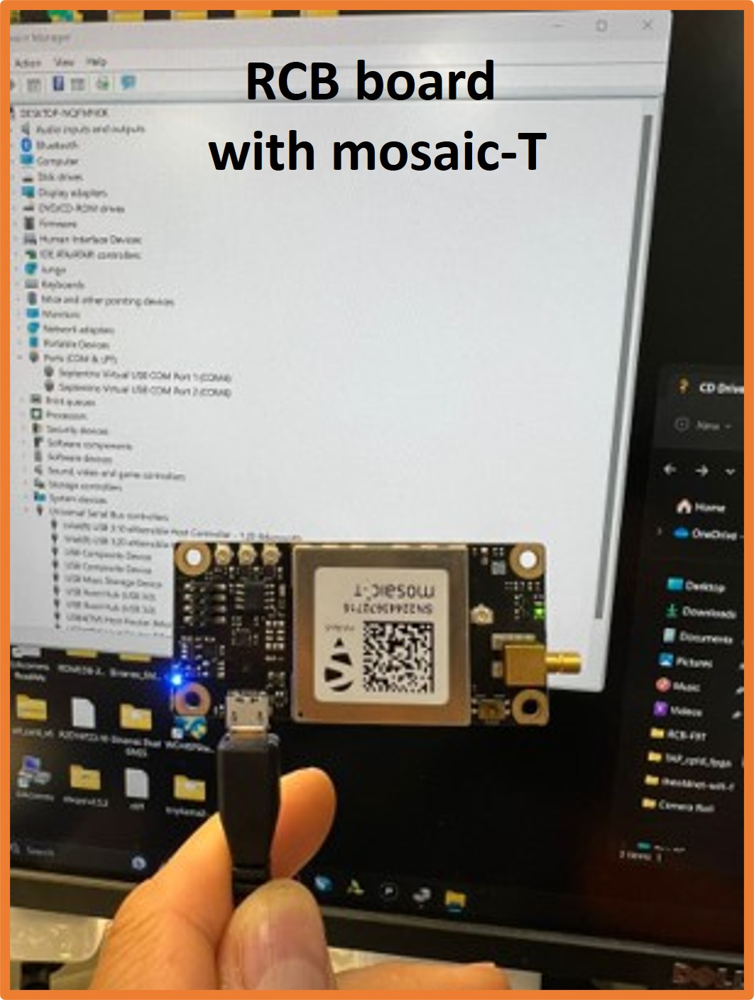

  

# Mosaic-Timecard

<!-- 

- AIM+
- IONO+
- Accuracy with AtomiChron
- Multi-constellations, multi-band
- Purpose of Timecard & RCB
- Connectors on the board

-->

---
## What is the Timecard
The Timecard is the heart of the [Open Time Server](https://github.com/opencomputeproject/Time-Appliance-Project/tree/master/Open-Time-Server/) project.

Accurate timing is a critical part of a PTP enabled network. 
The Time Card provides this via GNSS while maintaining accuracy in case of GNSS signal loss or failure by using a high stability and holdover oscillator.
The Time Card project was created to provide a open source solution via a PCIe card.

## How the Timecard is used
The Timecard can generally be used in 2 ways: Standalone and in a Full System.
In using the Timecard as standalone, you only need the Timecard and a device
with PCIe capabilities. 
You now have the option to retrieve a PHC (Physical Hardware Clock) time which can be set for system time.
This is done over PCIe where the Timecard shows up as a device.
For PPS output this is available over the U.FL connectors on the Timecard and can be used as needed.
 
The other way is to integrate the Timecard into a full system.
This includes a NIC (Network Interface Card) and the Timebeat software.
The way this system works is the Timecard is plugged into a PCIe slot.
Which powers the board and starts providing PPS output over U.FL connectors.
These can be plugged into a NIC with a U.FL adapter. 
This then provides the NIC with PPS from the Timecard. 
The software running on the device takes this input and converts it onto PTP (Precision Time Protocol). 
Which in turn can be used to synchronise devices on the network.

## Purpose of the Mosaic RCB
The Receiver Carrier Board (RCB) is a GNSS receiver board that provides PPS output and the TOD to
the Time Card. The RCB board integrates mosaic-T bringing the value of resilience and accuracy to the timing community.

The mosaic-T can be available on two RCB form factors: an M.2 (RCB) or in a traditional RCB form factor (well standarized by OCP-TAP).
This receiver carrier board provides PPS output coming from GNSS satellites. 
The route of this PPS signal originates from the Mosaic-T, then goes into the FPGA which does some filtering and correction.
This in turn becomes an input for the oscillator. 
The main use for the GNSS receiver is to control the drift from the oscillator. 
If the GNSS receiver loses signal the oscillator still provides accurate PPS until the receiver can regain signal.
Once the PPS signal has passed through the oscillator this signal is exposed using U.FL
connectors on the Timecard.

The OCP-TAP RCB form factor standardizes the dimensions, layout and connectivity of modular GNSS
receivers for OCP-TAP Time Cards.

A standard modular RCB Form Factor allows Time Card customers to interchange and upgrade GNSS
receivers with ease, and lets manufacturers an easier path to release new and improved GNSS receiver
that are compatible with OCP-TAP Time Cards.

The RCB Form Factor can lead to a faster pace of innovation and development as manufacturers can
focus on creating new components rather than iterating on the Time Servers, Time Cards and NICs for
each new product or revision.

  

### What is the mosaic module?
#### mosaic-T

<a href="https://www.septentrio.com/en/products/gps/gnss-receiver-modules/mosaic-t">Septentrio's mosaic-T</a>, multi-band, multi-constellation GNSS timing receiver design specifically for providing the highest security and availability for mission critical infrastructure and other resilient timing applications.
The mosaic-T is a low power surface mount module with a wide array of interfaces and dedicated timing inputs for time and frequency synchronization. It offers superior availability by tracking all Global Navigation Satellite System constellations (GNSS) and their current and future signals.
With unique built-in AIM+ technology for anti-jamming, anti-spoofing, interference mitigation Septentrio offers a highly resilient and precise timing receiver in a very small form factor.
With optional AtomiChronTMservices, mosaic-T is providing 4 constellation NMA for superior anti-spoofing and precise timing reaching sub nanosecond precision.

### mosaic-T Resilience
The mosaic-T features AIM+ Advanced Interference Monitoring and Mitigation, offering built-in protection against intentional and unintentional jamming and spoofing using a sophisticated system of sampling and mitigation mechanisms. The stationary nature of critical infrastructure makes it vulnerable to jamming or even to spoofing attacks. Jamming occurs when GPS signals are overpowered by illegal devices called “jammers”, which could for example be used in passing by vehicles to avoid road tolling. Spoofing is a malicious form of jamming where an attacker sends fake signals into the receivers. AIM+ offers protection against both jamming and spoofing for robust and resilient timing in any environment.

#### Other mosaic versions
Any <a href="https://web.septentrio.com/GH-SSN-modules c">other mosaic pin compatible products</a> could also be used on this design, however you would need to take into consideration the functions or pins which would need to exposed and then modify the design for your own project. Surely feel free to spin of the project and refer to this one should you make other open source designs based on this open source project.

### Who is Septentrio?

Septentrio designs, manufactures and sells high-precision, multi-frequency, multi-constellation GPS/GNSS equipment for use in demanding applications. Septentrio products are used in a wide variety of industries including marine, construction, precision agriculture, logistics, machine control, rail, automotive, survey and mapping, geographic information systems (GIS), unmanned aerial vehicles (UAVs) and scientific. Septentrio receivers deliver consistently accurate and precise GNSS positioning scalable to centimeter-level and designed to perform solidly in the most challenging environments. Septentrio receivers are available as OEM boards, housed receivers and smart antennas.

The technology offers high accuracy and reliability thanks to GNSS+ algorithms as well as <a href="https://www.septentrio.com/en/advanced-interference-monitoring-mitigation-aim">Septentrio's Advanced Interference Monitoring and Mitigation (AIM+)</a> which protects against RF interference (jamming) and spoofing.

For more information about Septentrio products go to <https://www.septentrio.com/>.

---
### How to produce the Timecard and Mosaic RCB
[Production](Production.md)  

### How to configure the Timecard and Mosaic
[Configuration](Configuration.md)  

### How to use the Timecard
[Application](Application.md)
